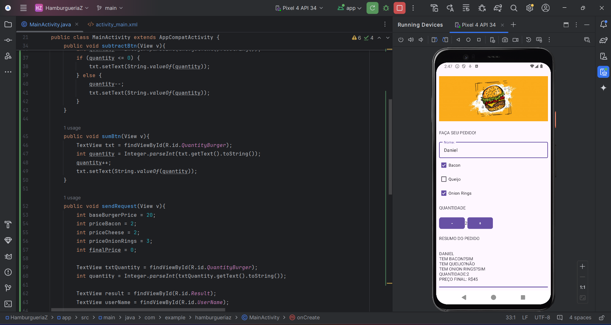

# HamburgueriaZ🍔

> Projeto portfolio 5° semestre Analise Desenvolvimento de Sistemas, utilizando Android Studio

imagem ilustrativa...

## Tecnologias utilizadas 🚀

Antes de instalar o projeto e recomendado você ter os seguintes requisitos:

-   Necessario ter `Java SDK` instalado.
-   Requisito `Git` para clonar.
-   Sua maquina `Windows, Linux ou Mac`.
-   Necessario `IDE` exemplo `Adnroid Studio`.
-   Conhecimento basico `Java`.
